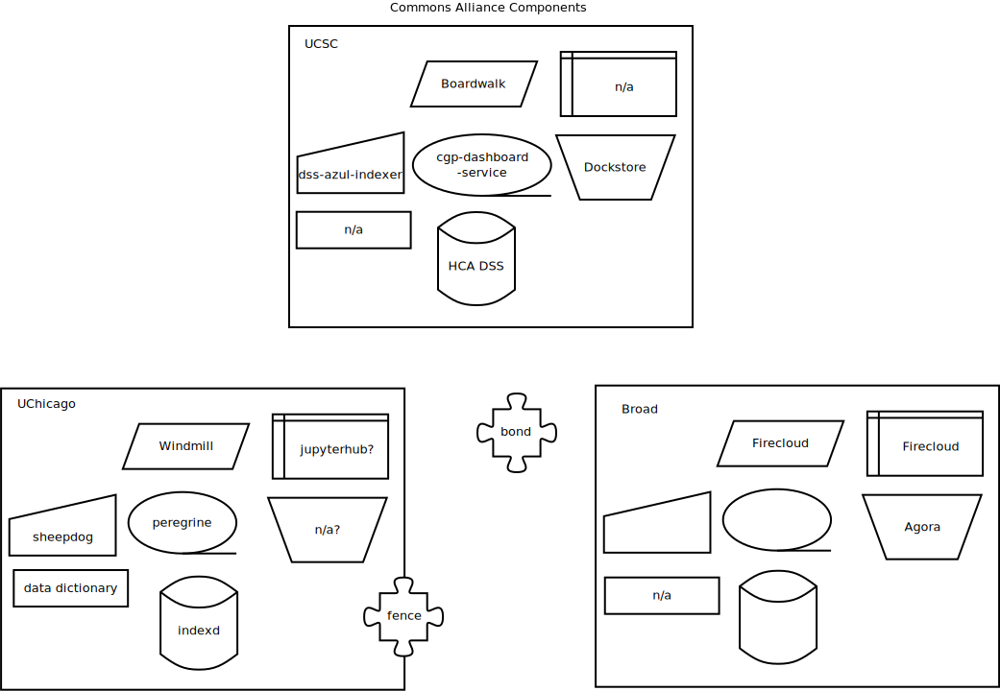

# Commons Alliance Components

This repository will try to explain the components that take part 
in the Team Calcium NIH DCPPC Pilot (and beyond).

Read the [Data Biosphere post](https://medium.com/@benedictpaten/a-data-biosphere-for-biomedical-research-d212bbfae95d).

## Prototype

Commons entrants offer some, or all of a set of services in order 
to take part in Commons infrastructure.

## Commons Alliance Components

## Development

This document is under active development. If you feel misrepresented or something has been
miscommunicated, please open an issue or make a Pull Request!

## Editing diagrams

The program used to edit the "dia" files is [dia](http://dia-installer.de/).

Github caches images when they display READMEs so be sure to check the actual file if 
it seems out of date!

