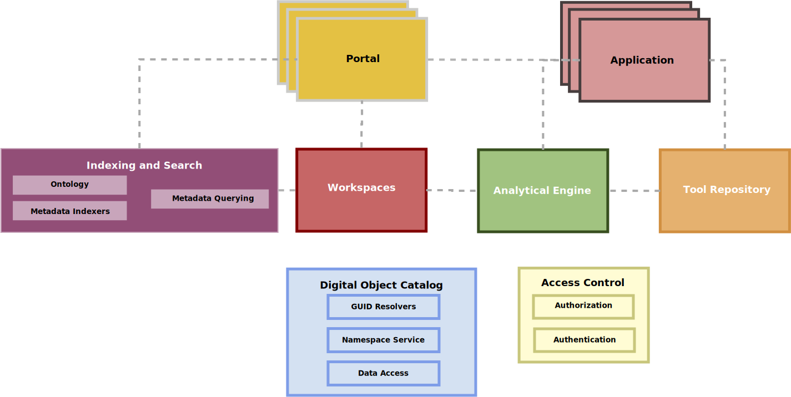
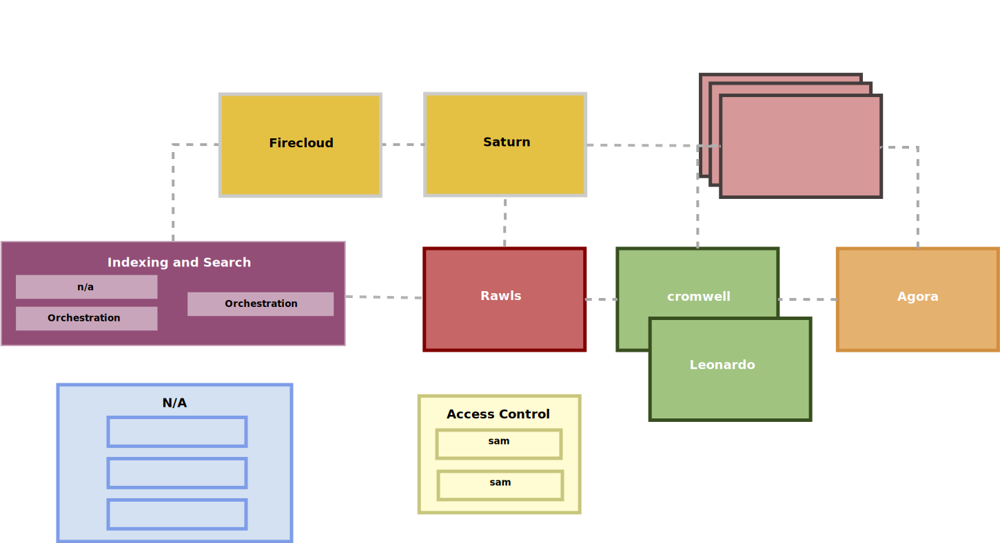

# Commons Alliance Components

This repository will try to explain the components that take part 
in the Team Calcium NIH Data Commons Pilot (and beyond).

Note, if you are viewing this on github, the images may be cached, please visit:

https://david4096.github.io/data-platforms/

For more background read the [Data Biosphere post](https://medium.com/@benedictpaten/a-data-biosphere-for-biomedical-research-d212bbfae95d).

Visit the [DataBiosphere github organization](https://github.com/DataBiosphere).

## Prototype

The various components coordinate to create a platform useful for data analysis.

### Digital Object Catalog

Provides clients and services access to resources available in object stores. Digital objects
can be files and the catalog itself maintains a registry of locations to find the files, as 
well as minimal metadata.

#### GUID Resolver

Allows globally unique identifiers to be "resolved" to digital objects. 

#### Namespace Service

Identifiers can be given different namespaces or "prefixes". The namespace service allows commons 
members to easily manage GUIDs across projects and domains.

### Access Control

To guarantee authority and authenticity of requests, some access control services are provided. 
These services will at least be able to identify a client and delegate authority to the access 
control system of choice.

### Analytical Engine

Software which can orchestrate and execute computational tasks in heterogeneous computing 
environments

### Tool Repository

A resource which contains templates of reusable computational tasks that can be directed at new 
data, and then executed by the Analytical Engine.

### Workspaces

Clients accessing a commons infrastructure should be able to manage data for secondary and 
tertiary data analysis.

### Indexing and Search

Data in commons infrastructure should be findable using Search mechanisms. Indexing makes data 
available for search.

#### Ontology

A controlled vocabulary informs indexers and or querying applications to make metadata usable.

#### Metadata Indexer

Metadata made available by a platform is indexed into a store. Indexers allow data to be made 
findable using a structured document scheme.

#### Metadata Querying

Once metadata have been indexed into a platform, these indices are made available by services 
that allow queries to be formed against the metadata.

### Portal

Commons infrastructure should provide interfaces to make data easily findable. Once data has been 
found in a portal, it can be added to a workspace.

### Application

Applications combine a variety of Commons components to carry out specific tasks.

## Commons Alliance Components

### Source Code Repository Table

Links to source code repositories for implementations are provided below:

| Component              |          [Broad][20]     |  [UChicago CDIS][21]  |       [UCSC CGP][22]          |
|------------------------|--------------------------|-----------------------|-------------------------------|
| Digital Object Catalog |                          |                       |                               |
| GUID Resolver          |                          |  [indexd][6]          |  [dos-azul-lambda][13]        |
| Namespace Service      |                          |  [indexd][6]          |                               |
| Access Control         |                          |                       |                               |
| Authorization          |   [sam][1] [bond][2]     |  [fence][7]           |                               |
| Authentication         |   [sam][1] [bond][2]     |  [fence][7]           |                               |
| Analytical Engine      |   [Cromwell][3]          |                       |  [toil][14]                   |
| Tool Repository        |   [Agora][4]             |                       |  [Dockstore][15]              |
| Workspaces             |   [Firecloud][5]         | [jupyterhub][8]       |                               |
| Indexing and Search    |                          |                       |                               |
| Ontology               |                          | [datadictionary][9]   |                               |
| Metadata Indexer       |                          | [sheepdog][10]        | [cgp-dss-azul-indexer][16]    |
| Metadata Querying      |                          | [peregrine][11]       | [cgp-dashboard-service][17]   |
| Portal                 |                          | [windmill][12]        | [boardwalk][18]               |
| Application            |                          |                       | [xena][19]                    |

[1]: https://github.com/broadinstitute/sam
[2]: https://github.com/DataBiosphere/bond
[3]: https://github.com/broadinstitute/cromwell
[4]: https://github.com/broadinstitute/agora
[5]: https://github.com/broadinstitute/firecloud-ui
[6]: https://github.com/uc-cdis/indexd
[7]: https://github.com/uc-cdis/fence
[8]: https://github.com/jupyterhub/jupyterhub
[9]: https://github.com/uc-cdis/datadictionary
[10]: https://github.com/uc-cdis/sheepdog
[11]: https://github.com/uc-cdis/peregrine
[12]: https://github.com/uc-cdis/data-portal
[13]: https://github.com/DataBiosphere/dos-azul-lambda
[14]: https://github.com/BD2KGenomics/toil
[15]: https://github.com/ga4gh/dockstore
[16]: https://github.com/DataBiosphere/cgp-dss-azul-indexer
[17]: https://github.com/DataBiosphere/cgp-dashboard-service
[18]: https://github.com/DataBiosphere/cgp-boardwalk
[19]: https://github.com/ucscXena/ucsc-xena-server
[20]: https://www.broadinstitute.org/
[21]: https://cdis.uchicago.edu/gen3
[22]: https://cgl.genomics.ucsc.edu/

### UChicago CDIS

The University of Chicago, CDIS groups presents software for easily managing the submission and 
access control of bioinformatics and medical informatics data in cloud environments.

### UC Santa Cruz Computational Genomics Platform

### Broad Institute

## Development

This document is under active development. If you feel misrepresented or something has been
miscommunicated, please open an issue or make a Pull Request!

## Editing diagrams

The program used to edit the "dia" files is [dia](http://dia-installer.de/).

Github caches images when they display READMEs so be sure to check the actual file if 
it seems out of date!

