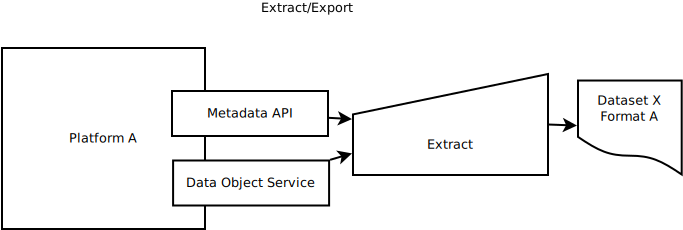
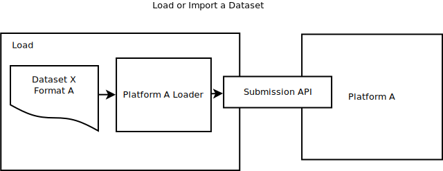
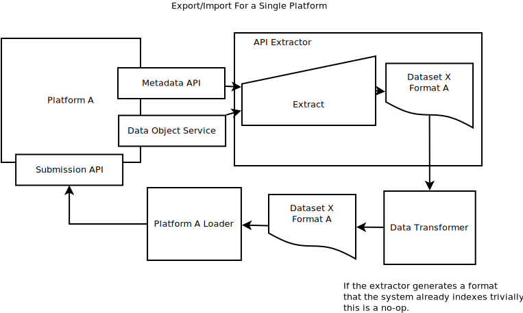
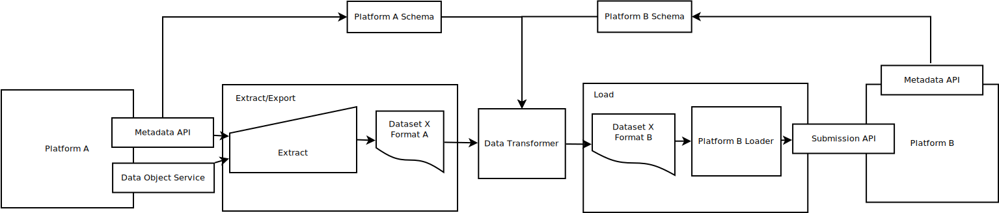
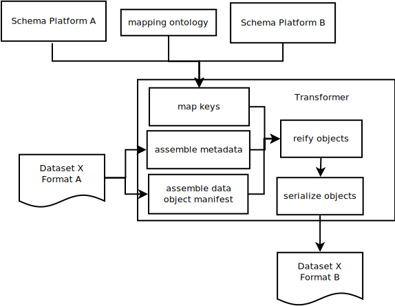
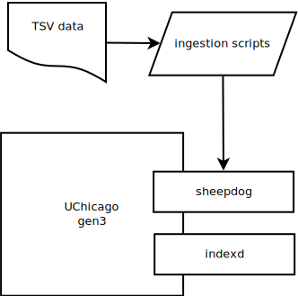
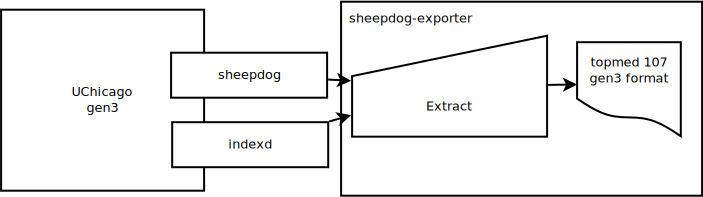
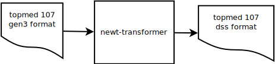
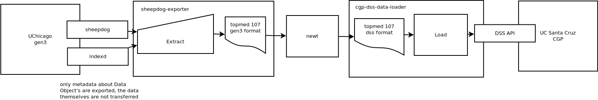

# Metadata Serialization

This document offers ways for platforms that are part of the NIH Data Commons Pilot to demonstrate 
Key Capability 7 (KC7), which is needed to guarantee the findability and portability of data. This 
document was prepared for Team Calcium. Examples and links from existing platforms will be added 
as they become available.

If you know of useful Metadata Serialization techniques please make a Pull Request!

1. [Metadata Portability](#portability)
2. [Concepts](#concepts)
3. [Use Cases](#usecases)
4. [Core Metadata](#coremetadata)
5. [Annotation Resources](#resources)
6. [Case Studies](#casestudies)

<a name="portability" />

## Metadata Portability

This document is meant to provide strategies for Data Platforms, which have internal data 
management needs, to provide a path for clear interoperability in a Commons infrastructure.

A Data Commons provides a way for many services and Data Providers a way to interchange data, 
metadata, and the results of analyses. Without clear metadata, the data it points to will 
be difficult to index and make available for querying using clear semantics.

The Use Cases in this document are structured to address problems of serializing metadata that 
will minimize the impact on Data Platforms, while providing a clear ramp to making best use 
of available standards.

<a name="concepts" />

## Concepts

### Data 

For the purposes of this document it is important to separate the concepts of
data from metadata. Data are the first order items one would like to share, 
for example, a VCF might be data, while the file checksum would be metadata.

### Metadata

Metadata describe data and are usually string keys paired with string, numeric, 
array, or object-like values. Metadata should be representable in JSON schemas.

### Data Object

A file, resource, or API that has been uniquely identified for a given 
service, and which provides a minimum of fields from the Data Object 
Service schema.

### Serialization

Data as it is stored on disk or transmitted on a wire is sent as a serial 
ordered list of bits and can be a file or wire format. When a serialized 
message has been retrieved it is deserialized into memory.

### JSON

JavaScript Object Notation is a scheme for transmitting data between web 
services. Both metadata and interface methods for services in this document
communicate using JSON.

### JSON-LD

Extensions to JSON that allows it to represent links between Objects using
the addition of @context and @id protected keys.

### Ontology

A controlled vocabulary that allows hierarchical relationships between items
to be represented in a machine readable way.

### API

Application Programming Interface allow applications to be extended to other 
purposes and for programs to more easily communicate with each other.

### Extract

The process of accessing the relevant APIs needed to select some metadata for 
export. This can be carried out by one or more programs and often requires 
performing authenticated requests against a platform. The first stage of the
Extract, Transform, Load process.

### Transform

Data extracted from a platform is altered into a format suitable 
for loading into another platform. Explicit assumptions about the data model 
of the target format are made clear in transformer programs. The second 
stage of the Extract, Transform, Load process.

### Load

Once data have been tranformed into a format that is suitable for indexing 
into a platform, loader programs call the required submission APIs. The last 
stage of the Extract, Tranform, Load process.

<a name="usecases" />

## Use Cases

### Export Metadata to a Serialization Format

When arriving at a Data Platform, a client should be able to export data in some 
serialized format. That format may make implicit assumptions about the data model 
it is based on. 

The resulting export format should be useful for reasoning about the content of 
data provided by the platform. For example, exporting a TSV manifest of files 
from a file browser can be used by a downloader to create a local copy of a 
dataset.

### Import Metadata from a Serialization Format

Data Platforms should be able to import datasets given some serialized format. 
That format may make implicit assumptions about the Data Platform's data model.
It uses clearly defined interfaces in a Submissions API to import metadata from 
a described metadata serialization format.

### Export and Import Using the Same Format

By combining import and export use cases, a Platform is able to load data that 
has been exported from it. The serialized format may make implicit assumptions 
about the data model that will be imported. In this case, the transformation 
process may make minimal modifications to the metadata.

### Export Metadata from Platform A and Import to B

To support automated metadata interchange, a Data Platform should be able to 
export metadata, which eventually can be imported into a different Data Platform.

A client can coordinate this interaction by first requesting metadata from Data
Platform A. Using its Metadata API, it generates a serialized version of the 
dataset. The dataset, which may make implicit assumptions about the data model of
Platform A, is then provided to a Transformer. 

The Transformer program uses 
as much available data about the metadata model of A to translate metadata to be
imported into in Platform B. The resulting transformed dataset can then be 
imported using Platform B's Submissions API.

### Transformer Detail

The transformer program makes clear the cost of curating metadata from one 
serialization format to another. The goal is to provide a clear programmable 
interface for transforming metadata.

When using concrete versioned mappings between the metadata schemas provided 
by two platforms, it makes explicit the technical and human cost of data curation. 
If standards-based libraries are available, these software versions should 
also be explicitly defined.

<a name="coremetadata" />

## Core Metadata

Core metadata are metadata that are considered crucial for carrying out some 
simple tasks, like contacting the owner of a dataset, offering deduplication 
of data, and others.

Core metadata are described by use cases, and each service implements its own 
set of core metadata requirements defined by the use cases it supports.

### Core Metadata Use Cases

### Deduplication

Checksums of data allow Data Providers a way to reason about how to organize 
indexing and storage to reduce duplication. Core metadata should include at 
least one checksum, and having an extensible model for adding checksums 
provides some future-proofing.

### Ownership

To determine the original owner of some piece of data, clear metadata describing 
ownership should be available with datasets. This should include licensing 
information if available.

### Provenance and Replication

Metadata are expected to be indexed and replicated many times. Providing metadata 
regarding how the data arrived where it is are important in assisting replication.

Data analysis metadata are required in order to regenerate the results of an 
analysis.

### Data Use and Consent

Structured metadata regarding the consent status of some data should be available. 
This allows services to determine access levels, and what types of analyses some 
data are available for.

### JSON-LD Context Example

<a name="resources" />

## Annotation Resources

Metadata annotation and linking are crucial to providing metadata serialization formats 
that can be easily interchanged and later indexed and queried.

A number of resources exist to make it easier to make well annotated metadata. If you would 
like to see your service here, open a PR!

### schema.org

[schema.org](https://schema.org) hosts document types that can be used to provide 
structured metadata. Annotating documents using schema.org types can make it easier 
for the to be indexed later.

### Bioschemas

http://bioschemas.org/

>Bioschemas aims to improve data interoperability in life sciences. It does this by encouraging people in life science to use schema.org markup, so that their websites and services contain consistently structured information. This structured information then makes it easier to discover, collate and analyse distributed data.

>The main outcome of Bioschemas is a collection of specifications that provide guidelines to facilitate a more consistent adoption of schema.org markup within the life sciences. 

### Zooma

https://www.ebi.ac.uk/spot/zooma/

> Zooma is a tool for mapping free text annotations to ontology term based on a curated repository of annotation knowledge.
> Where mappings are not found in the curated respository one or more ontologies can be selected from the Ontology Lookup Service to increase coverage. For example if you want to map GWAS annotations select the GWAS datasource and a common disease ontology such as EFO or DOID to maximise coverage when terms have no curated mappings. 

### biocontext

https://github.com/prefixcommons/biocontext/issues/15

> ... a modular set of JSON-LD contexts for mapping abbreviated names of biological objects onto URIs for use in semantic web tool chains. Here, "abbreviated name" usually means a CURIE but optionally human-friendly symbolic names (e.g. gene) can also be used as abbrevations for complete URIs...

<a name="casestudies" />

## Case Studies

### UChicago gen3 to UCSC CGP Data Commons

A useful Data Commons is made up of players who can work towards the automation of data federation, 
replication, and shared analysis. To enable this, Platforms should be able serialize metadata in an 
automated fashion, and provide useful software for working with that data.

University of California, Santa Cruz and University of Chicago are piloting a Commons 
infrastructure that will allow them to make data findable on both the UCSC Computational Genomics 
Platform (CGP) and University of Chicago's gen3 Data Platform. This is an area of activate development as
demonstrating these features are part of NIH Data Commons Pilot Key Capability 7 (KC7).

#### Exporting from UChicago

For this Case Study, data and metadata were first prepared for the gen3 platform. University of Chicago 
provides [applications](https://cdis.uchicago.edu/gen3) and [data dictionaries](https://github.com/uc-cdis/datadictionary) 
to manage metadata for bioinformatics and some medical informatics. 

Once data and metadata are prepared and loaded into the gen3 platform, they are made available through
[sheepdog](https://github.com/uc-cdis/sheepdog), an API for managing submissions.

Sheepdog makes available an API that provides content negotation using URL parameters. An authorized 
client can make requests to determine available datasets, which have been organized by "Program" and
"Project".

For this case study, we developed software to make exporting data from gen3 straight forward and 
unopinionated, with the goal of developing software that could enable any platform to take part in 
Commons exchange.

[sheepdog-exporter](https://pypi.org/project/sheepdog-exporter/) uses credentials gathered from the gen3
platform to make authorized requests to sheepdog. This allows the client to extract available metadata. 
In addition, the URL locations in cloud object stores where files are saved are gathered from indexd.

The resulting exported format attempts to make as few assumtpions as possible about the gen3 metadata 
while retaining detailed structure and provenance.

#### Transforming Serialized Metadata

Once the metadata have been exported to a JSON format defined by sheepdog-exporter they need to be 
transformed into a format suitable for loading into another platform. In practice, both platforms 
make some assumptions about the order in which metadata must be added, or which items need to be 
assigned unique identifiers. In addition, downstream indexers may expect metadata to be normalized 
to a harmonized data model.

To support these Use Cases, UC Santa Cruz developed [newt-transformer](https://github.com/DataBiosphere/newt-transformer) 
which is meant to provide an extensible framework for transforming various metadata serialization 
formats from Commons Platforms.

Here, the newt-transformer takes as input the exported data from sheepdog-exporter to create a format 
suitable for loading into the DSS. These data are arranged following a schematic representation 
made available by the DSS loader.

#### Loading into UC Santa Cruz DSS

Once the metadata have been serialized from the gen3 Platform and transformed into a platform for 
the DSS, they are loaded using the [cgp-dss-data-loader](https://github.com/DataBiosphere/cgp-dss-data-loader). The data loader 
expects the format that the newt-transformer generated, and performs whatever necessary validation 
is required to load the data into the DSS.

Here we see the entirety of the case study in a single diagram. 

Starting from the left, metadata extracted from gen3 using sheepdog exporter are transformed into a 
format suitable for loading into the DSS.

The transformed metadata are finally loaded into the DSS using the cgp-dss-data-loader. By separating the software required to carry out this task into 
individual concerns, semantic versioning allows us to define a maintenance plan for a Commons 
Infrastructure.

This case study fulfills a number of individual use cases above, and provides a framework for improved automation.

